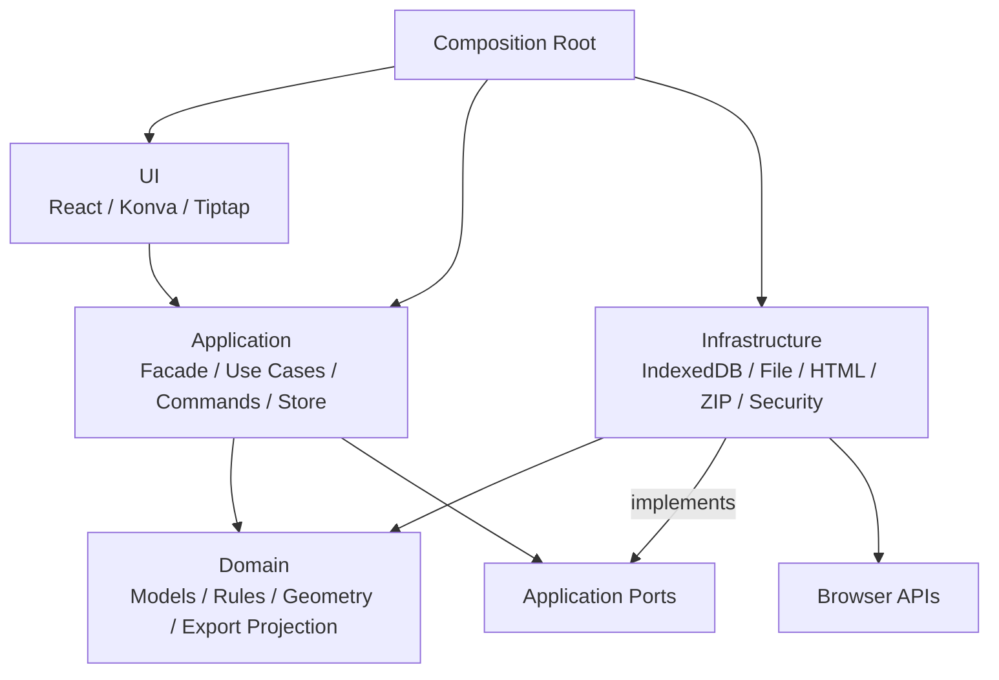

# CanvasDoc MVP 実装設計

## 1. アーキテクチャ概要

静的配布可能なクライアント完結型SPAとして実装する。依存方向をUI→Application→Domainに限定し、ブラウザAPIと外部ライブラリの具象実装をInfrastructureへ隔離する。依存注入は`src/app/composition/`だけで行う。



## 2. 実装境界

### 2.1 Domain

**責務**:

- 文書、章、節、要素、アセット、出力レイアウトの型と不変条件
- 文書ツリー・要素・出力レイアウトの純粋な更新
- 整列、座標変換、コネクタ経路
- 出力Projectionと技術非依存SVGモデル

**実装の要点**:

- React、Konva、Tiptap、Zustand、Zod、ブラウザAPIをimportしない。
- 文書要素は7種類の判別共用体とする。
- 外部入力検証後も、ID・参照・順序の不変条件をDomain Validatorで確認する。
- 新しい要素型を追加すると、網羅的分岐とRenderer Registryがコンパイルエラーになるようにする。

### 2.2 Application

**責務**:

- `EditorFacade`によるUI向け書き込みAPI
- Commandと最大100件のUndo/Redo
- 新規作成、読込、保存、復元、出力ユースケース
- Zustand Store、dirty状態、自動保存調停
- Infrastructure向けPort

**実装の要点**:

- 予測可能な失敗は`Result<T, ApplicationError>`で返す。
- 文書変更はCommandまたは文書初期化ユースケースだけが行う。
- 読込・復元は検証済みスナップショット完成後にStoreを一度だけ置換する。
- Infrastructureの具象クラスをimportしない。

### 2.3 Infrastructure

**責務**:

- Zodスキーマ、IndexedDB、File/Blob、ダウンロード
- DOMPurify、URL検証、リッチテキスト検証
- 型別HTML/SVG Renderer、単一HTML、JSZip
- Clock、UUID、画像デコード、Object URL管理

**実装の要点**:

- 外部JSON、IndexedDBの旧データ、画像、URLを信頼しない。
- 単一HTMLとZIPを同じ`ExportBundle`から生成する。
- HTMLはDOM APIで組み立て、DOMPurifyを最終防御に使う。
- ZIPパスは固定値とUUIDから生成する。

### 2.4 UI

**責務**:

- 3ペイン＋ツールバー＋ステータスバー
- 文書ツリー、Konvaキャンバス、プロパティ、出力アウトライン、プレビュー
- Tiptap編集面と各要素描画
- フォーカス、キーボード、ダイアログ、通知

**実装の要点**:

- Storeは用途別selectorで購読し、文書全体の再描画を避ける。
- ドラッグ中はKonvaローカル状態を使い、終了時に一Commandを確定する。
- TiptapとKonvaのランタイムオブジェクトをStoreへ保存しない。
- プレビューiframeへscript、same-origin、top-navigation権限を与えない。

## 3. 主要データ

### 3.1 文書ファイル

```typescript
interface CanvasDocumentFile {
  schemaVersion: 1;
  appVersion: string;
  document: CanvasDocument;
}
```

`CanvasDocument`は文書メタデータ、章配列、節辞書、画像アセット辞書、テーマを持つ。節は要素辞書、`zOrder`、`ExportLayout`、`CanvasViewport`を持つ。

### 3.2 状態の正本

| 状態 | 正本 | 永続化 |
|---|---|---|
| 文書 | Zustand Document Slice | JSON、IndexedDB |
| UI選択・ツール | Zustand UI Slice | なし |
| Undo/Redo | CommandManager | なし |
| ドラッグ中座標 | Konva Node | なし |
| リッチテキスト編集中 | Tiptap Editor | なし |
| プレビュー | 生成済みHTMLメモリ | なし |

### 3.3 Port

```typescript
interface RecoveryRepository {
  save(record: AutoSaveRecord): Promise<void>;
  load(): Promise<AutoSaveRecord | null>;
  delete(): Promise<void>;
}

interface DocumentFileGateway {
  read(file: File): Promise<string>;
  download(blob: Blob, fileName: string): Promise<void>;
}

interface ExportRenderer {
  render(document: CanvasDocument): Promise<ExportBundle>;
}

interface ArchivePackager {
  createZip(bundle: ExportBundle): Promise<Blob>;
}
```

## 4. データフロー

### 4.1 編集

```text
1. UIがポインター・キー入力をDomain DTOへ変換する。
2. EditorFacadeがCommandをCommandManagerへ渡す。
3. CommandがDomain操作で次の文書スナップショットを生成する。
4. 成功時だけStoreを原子的に更新し、Undo履歴へ追加する。
5. selector対象のUIだけ再描画する。
6. AutoSaveServiceが5秒デバウンス保存を予約する。
```

### 4.2 JSON読込

```text
1. File GatewayがUTF-8文字列として読み込む。
2. JSON.parseの結果をunknownとしてZodへ渡す。
3. schemaVersion、型、境界値を検証する。
4. Domain ValidatorでID、参照、順序、不変条件を検証する。
5. 正規化済みスナップショットを生成する。
6. 全工程成功後だけStoreを置換し、履歴をクリアする。
```

### 4.3 保存・自動保存

```text
1. Storeからイミュータブルな確定済みスナップショットを取得する。
2. 未参照画像を除き、値を正規化して検証する。
3. 明示保存はUTF-8 JSON Blobをダウンロードする。
4. 自動保存はIndexedDBのcurrent-documentを一件置換する。
5. 成功後に保存日時を更新する。失敗時は編集中状態を維持する。
```

### 4.4 HTML/ZIP出力

```text
1. 出力前検証でerrorとwarningを収集する。
2. 章、節、ExportLayoutから順序付きProjectionを生成する。
3. 型別Rendererが意味的HTMLとインラインSVGを生成する。
4. DOMPurifyと禁止URL・属性の再検査を行う。
5. HTML、CSS、画像をExportBundleへまとめる。
6. 単一HTMLまたはZIPへパッケージし、Blobをダウンロードする。
```

## 5. エラーハンドリング

### 5.1 エラー分類

| 分類 | 例 | 処理 |
|---|---|---|
| Domain Error | ロック要素の移動、参照不整合 | Commandを失敗させStoreを維持 |
| Validation Error | 不正JSON、未対応バージョン | 読込を中断し問題パスを表示 |
| Infrastructure Error | IndexedDB容量不足、ZIP失敗 | Application Errorへ変換 |
| Export Warning | 画像alt未入力、見出し補正 | 一覧表示し、確認後に続行可能 |
| Unexpected Error | プログラミングエラー | Error Boundaryで隔離しJSON保存を案内 |

### 5.2 Application Error

```typescript
interface ApplicationError {
  code: ApplicationErrorCode;
  userMessage: string;
  cause?: unknown;
  details?: Readonly<Record<string, string>>;
}
```

本番表示・ログへ本文、URL、画像、ローカルパス、Data URLを含めない。

## 6. セキュリティ設計

- JSONとIndexedDBデータはZodの既知フィールドだけを採用する。
- Tiptap JSONは許可ノード・マークだけを保存する。
- URLは`http:`、`https:`、`mailto:`だけを許可する。
- HTML文字列へ未処理ユーザー値を補間せず、DOM APIと型別Rendererを使う。
- SVGでscript、`foreignObject`、イベント属性、外部参照を生成しない。
- iframeはsandboxを使い、scriptと同一オリジン権限を与えない。
- ZIP名は`assets/{assetId}.{extension}`とし、元ファイル名をパスに使わない。
- テストfixtureに実文書・個人情報を使用しない。

## 7. パフォーマンス設計

- アクティブ節のKonva Stageだけをマウントする。
- ドラッグ中にStore全体を更新しない。
- 要素参照はID辞書を使う。
- 画像Data URLをUndo履歴ごとに複製しない。
- 画像デコード結果を上限付きでキャッシュする。
- プレビュー生成は500msデバウンスし、古い要求を破棄する。
- JSON/HTML/ZIPのLong Taskを計測し、50ms超が性能要件を妨げる場合だけWorkerへ移す。

## 8. テスト戦略

### Unit

- Domainモデル、不変条件、文書操作
- 座標変換、整列、コネクタ経路
- Command実行・Undo/Redo・マージ
- Zod境界値、URL、リッチテキスト
- Export Projection、Renderer、SVG、ファイル名

### Integration

- Store、Command、出力アウトライン同期
- IndexedDB自動保存・復元・容量不足
- JSON保存・読込ラウンドトリップと失敗時保全
- ExportBundle、単一HTML、ZIP
- React ComponentとFacadeの接続

### E2E

- 新規文書→章節→全要素→保存→再読込
- 自動保存→再起動→復元・破棄
- 出力アウトライン→単一HTML→オフライン閲覧
- ZIP→展開→相対アセット→オフライン閲覧
- 360px、768px、1440pxのレスポンシブ表示
- Chrome、Edge、Firefox編集、WebKit生成物閲覧

### Security・Performance

- XSS、危険URL、SVG注入、Prototype Pollution、ZIPパス
- 50節、500要素、画像合計50MB
- 読込5秒、生成10秒、操作フレーム95%以上30fps

## 9. 依存ライブラリ

実装開始時に採用メジャー系列の互換する最新安定版を導入し、解決済みバージョンを`package-lock.json`へ固定する。

```json
{
  "dependencies": {
    "@tiptap/core": "^3",
    "@tiptap/react": "^3",
    "@tiptap/starter-kit": "^3",
    "dompurify": "^3",
    "idb": "^8",
    "immer": "^10",
    "jszip": "^3",
    "konva": "^9",
    "react": "^19",
    "react-dom": "^19",
    "react-konva": "^19",
    "zod": "^4",
    "zustand": "^5"
  },
  "devDependencies": {
    "@playwright/test": "^1",
    "@testing-library/react": "^16",
    "@types/dompurify": "^3",
    "@types/react": "^19",
    "@types/react-dom": "^19",
    "@vitejs/plugin-react": "^4",
    "@vitest/coverage-v8": "^3",
    "eslint": "^9",
    "fake-indexeddb": "^6",
    "prettier": "^3",
    "typescript": "^5",
    "vite": "^7",
    "vitest": "^3"
  }
}
```

導入時に相互互換性を確認し、系列変更が必要な場合は`docs/architecture.md`の技術スタックとADRを同じPRで更新する。不要な型パッケージは、ライブラリが型を同梱している場合は追加しない。

## 10. 実装対象構造

```text
src/
├── app/                 # Composition Root、起動、Provider
├── domain/
│   ├── document/
│   ├── geometry/
│   ├── export/
│   └── shared/
├── application/
│   ├── commands/
│   ├── use-cases/
│   ├── ports/
│   ├── services/
│   ├── store/
│   └── errors/
├── infrastructure/
│   ├── persistence/
│   ├── files/
│   ├── export/
│   ├── security/
│   ├── browser/
│   ├── schemas/
│   └── workers/
└── ui/
    ├── features/
    ├── components/
    ├── hooks/
    ├── styles/
    └── accessibility/

tests/
├── unit/
├── integration/
├── e2e/
├── security/
├── performance/
├── fixtures/
└── support/
```

詳細な配置と依存許可は`docs/repository-structure.md`を正とする。

## 11. 実装順序とPull Request境界

1. PR-01: プロジェクト基盤、品質ツール、CI、レイヤー骨格
2. PR-02: Domain文書モデル、検証、幾何、出力Projection
3. PR-03: Application Store、Command、Undo/Redo、Facade
4. PR-04: JSONファイル、IndexedDB、自動保存・復元
5. PR-05: Application Shell、文書ツリー、プロパティ共通UI
6. PR-06: Konvaキャンバス基盤、選択、移動、ズーム、整列
7. PR-07: 7要素の作成・編集、Tiptap、画像、表、コネクタ
8. PR-08: 出力アウトライン、レイアウトグループ、プレビュー
9. PR-09: 意味的HTML、SVG、単一HTML出力
10. PR-10: ZIP出力、ファイル名、両出力形式の整合
11. PR-11: セキュリティ、アクセシビリティ、性能、全ブラウザ、リリース品質

各PRは対応するUnit/Integration/E2E、設計差分、tasklist進捗更新を含める。developをbaseとする作業PRを作成し、PR作成後は次へ進まずユーザーへ報告する。release時だけdevelopからmainへ統合する。

## 12. 将来拡張

- 新要素型はDomain型、Schema、Command、Canvas Renderer、Inspector、HTML Renderer、テストを一組で追加する。
- 大規模文書の性能要求が発生した場合、節遅延ロード、ビューポートカリング、Workerの順に導入する。
- クラウド保存は既存PortへAdapterを足すだけでは完結しないため、認証・競合解決・監査を含む別アーキテクチャとして設計する。
- HTML Rendererを別製品で再利用する要件が生じた場合のみ、npm workspacesによるパッケージ分割を検討する。

