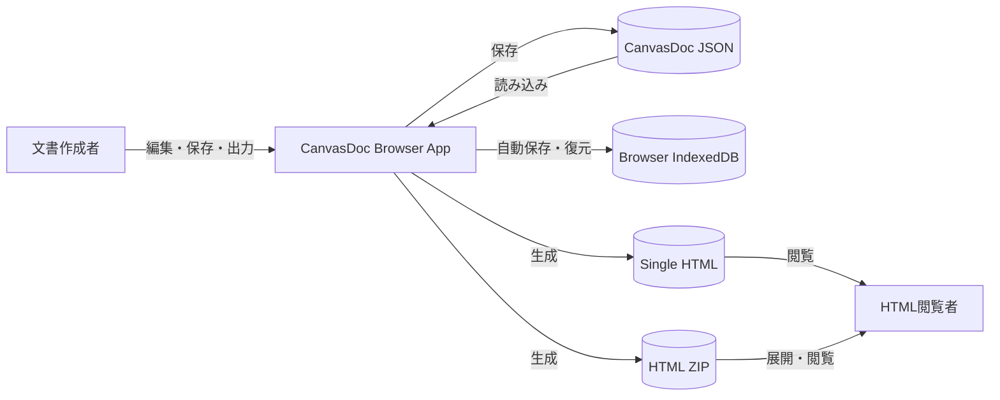
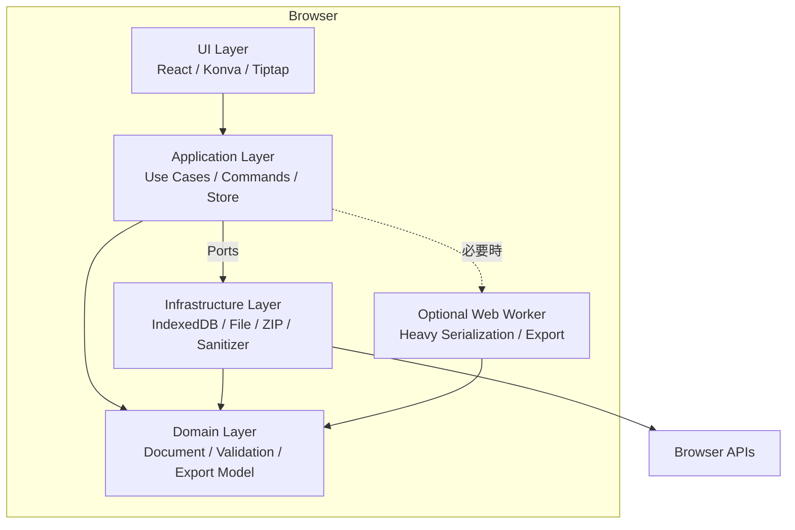
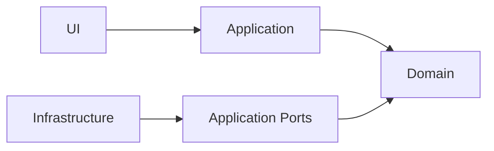
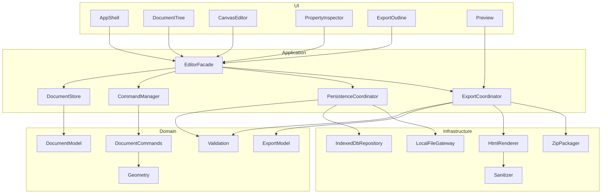
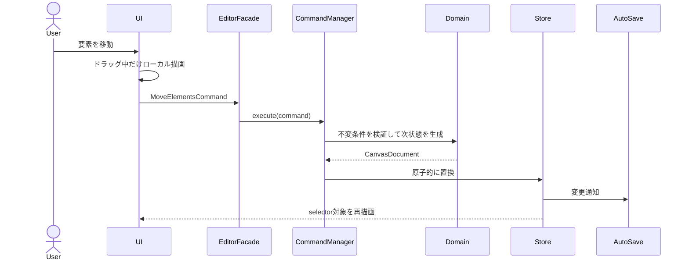
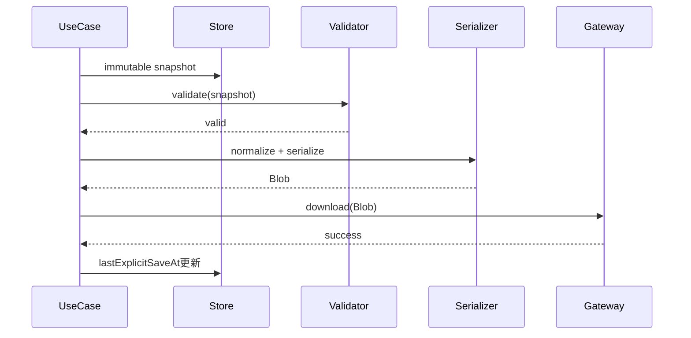
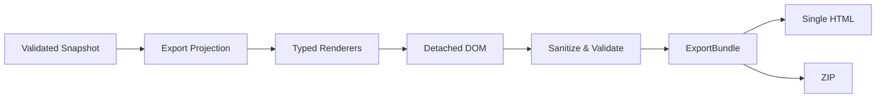
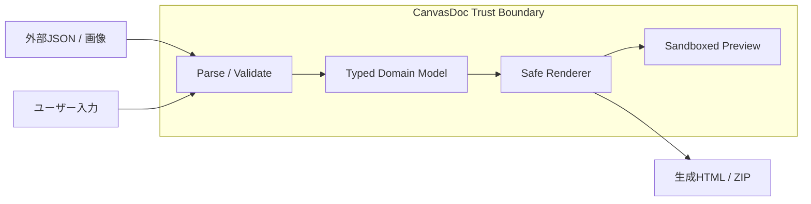

# アーキテクチャ設計書 (Architecture Design Document)

## 1. 文書情報

| 項目 | 内容 |
|---|---|
| プロダクト | CanvasDoc（仮称） |
| 対象リリース | MVP |
| 参照PRD | `docs/product-requirements.md` |
| 参照機能設計 | `docs/functional-design.md` |
| アーキテクチャ種別 | クライアント完結型SPA |
| バックエンド | なし |

## 2. アーキテクチャ概要

CanvasDocは、静的ファイルとして配布できるブラウザアプリとする。文書の編集、検証、自動保存、JSON入出力、HTML生成、ZIP生成はすべてユーザーのブラウザ内で実行し、文書内容を外部サーバーへ送信しない。

内部構造は、UI、Application、Domain、Infrastructureの4層に分ける。依存方向は外側から内側への一方向とし、Domain層はReact、Konva、IndexedDBなどの実装技術へ依存しない。ブラウザAPIと外部ライブラリはInfrastructureまたはUIのアダプター内へ閉じ込める。

### 2.1 アーキテクチャ目標

- 自由配置編集とレスポンシブHTML生成を、独立したモデルとして安全に両立する。
- ファイル読込、保存、自動保存、出力失敗時に、編集中の文書状態を破壊しない。
- 500要素、画像合計50MBの標準文書でPRDの性能目標を満たす。
- ユーザー入力から生成HTMLまで、一貫した検証とサニタイズ境界を設ける。
- キャンバス、リッチテキスト、永続化ライブラリを将来交換できる構造にする。
- サーバー追加や共同編集をMVPへ持ち込まず、ローカル個人利用に最適化する。

## 3. アーキテクチャドライバー

### 3.1 機能ドライバー

| ドライバー | アーキテクチャへの影響 |
|---|---|
| 節ごとの無限キャンバス | アクティブ節のみ描画し、描画エンジンをUIアダプターへ隔離する |
| 7種類の文書要素 | Domainで判別共用体として表現し、型別レンダラーを追加可能にする |
| JSON保存・読込 | バージョン付きスキーマと検証済みの原子的な文書置換を採用する |
| IndexedDB自動保存 | 永続化ポートを定義し、ブラウザストレージ実装をInfrastructureへ置く |
| 単一HTMLとZIP出力 | 共通の中間表現`ExportBundle`から2形式を生成する |
| HTML読み順の明示管理 | キャンバス描画順と出力レイアウトを別の集約として保持する |

### 3.2 品質ドライバー

| 優先度 | 品質属性 | 目標 |
|---|---|---|
| 1 | データ保全性 | 失敗した読込・保存・出力が現在文書を変更しない |
| 2 | セキュリティ | 任意スクリプト、危険URL、外部参照を生成HTMLへ混入させない |
| 3 | 操作応答性 | 500要素で操作フレームの95%以上を30fps以上にする |
| 4 | 可搬性 | 静的ホスティングまたはローカル開発サーバーだけで動作する |
| 5 | 保守性 | DomainのユニットテストをDOMやブラウザなしで実行できる |
| 6 | 拡張性 | 要素型、保存スキーマ、出力レンダラーを明示的な登録点から追加できる |

### 3.3 制約

- 編集対象は画面幅1024px以上のデスクトップブラウザとする。
- 正式対応はWindows 11上の最新安定版Chrome、Edgeとする。
- 外部CDN、外部フォント、サーバーAPI、テレメトリーを使用しない。
- 生成HTMLはJavaScriptなしで内容を閲覧可能にする。
- 文書データの正本は型付きJSONとし、キャンバス描画オブジェクトやHTML DOMを正本にしない。

## 4. コンテキストとコンテナ

### 4.1 システムコンテキスト



### 4.2 ブラウザ内コンテナ



Web WorkerはMVP開始時点では必須としない。50msを超えるメインスレッド停止または性能要件未達が計測された処理だけを、同じDomain APIを使うWorkerへ移す。

## 5. テクノロジースタック

バージョンは実装開始時に下表のメジャー系列で最新の安定版を選び、`package-lock.json`へ完全解決版を固定する。メジャー更新はアーキテクチャレビューを必須とする。

### 5.1 言語・ランタイム

| 技術 | 採用系列 | 用途 | 選定理由 |
|---|---|---|---|
| Node.js | 24 LTS | 開発、ビルド、テスト | 長期サポート系列を使い、開発環境の再現性を確保する。実行成果物には含めない |
| npm | 11.x | パッケージ管理 | Node.js標準ツールであり、lockfileと`npm ci`による再現可能な導入ができる |
| TypeScript | 5.x | 全プロダクションコード | 文書要素の判別共用体、ポート、スキーマ対応型を静的検証できる |
| ECMAScript | ES2022 | ブラウザ出力ターゲット | 正式対応ブラウザで利用可能な機能と、十分なデバッグ性を両立する |

### 5.2 フレームワーク・ライブラリ

| 技術 | 採用系列 | 用途 | 選定理由 |
|---|---|---|---|
| React | 19.x | UIコンポーネント | 複数ペイン、ダイアログ、プロパティ編集を宣言的に構成できる |
| Vite | 7.x | 開発サーバー、ビルド | クライアント専用SPAの高速な開発と静的成果物生成に適する |
| Zustand | 5.x | Application/UI状態 | 小さなAPIで選択的購読ができ、500要素時の再描画範囲を制御しやすい |
| Immer | 10.x | 状態更新 | 深い文書モデルをイミュータブルに更新し、Command実装を簡潔にする |
| Konva / react-konva | 9.x / 19.x互換系列 | キャンバス描画 | パン、ズーム、Transformer、図形、ポインター操作をCanvas 2Dで提供する |
| Tiptap | 3.x | リッチテキスト編集 | 使用ノードとマークを明示的に制限でき、JSONモデルを正本にできる |
| Zod | 4.x | 実行時スキーマ検証 | 外部JSONを`unknown`から検証済み型へ変換できる |
| DOMPurify | 3.x | 防御的サニタイズ | 出力およびプレビューのHTMLに対する多層防御として使用できる |
| idb | 8.x | IndexedDBアダプター | Promiseベースでトランザクションを扱い、ブラウザAPIを薄くラップできる |
| JSZip | 3.x | ZIP生成 | クライアント内でHTML、CSS、画像をアーカイブできる |

ライブラリの互換性が採用系列と一致しない場合は、実装開始時に互換する最新安定系列へ調整し、変更理由をADRへ記録する。機能要件をライブラリ固有APIへ直接結合させない。

### 5.3 開発・品質ツール

| 技術 | 採用系列 | 用途 | 選定理由 |
|---|---|---|---|
| Vitest | 3.x以上のVite互換系列 | 単体・統合テスト | Vite/TypeScript設定を共有し、高速にDomainテストを実行できる |
| Testing Library | 最新安定系列 | React UIテスト | 実装詳細ではなく利用者の操作とアクセシブル名で検証できる |
| Playwright | 1.x | E2E・ブラウザ互換 | Chromium、Firefox、WebKitとダウンロードを自動化できる |
| ESLint | 9.x | 静的解析 | TypeScriptとReactの不具合パターンをCIで検出できる |
| Prettier | 3.x | フォーマット | コードスタイル判断を自動化し、レビューを設計と挙動へ集中させる |
| axe-core | 4.x | アクセシビリティ検査 | 編集UIと生成HTMLの自動監査に使用できる |

## 6. レイヤードアーキテクチャ

```text
┌──────────────────────────────────────────────────────┐
│ UI                                                   │
│ React Components / Konva Adapter / Tiptap Adapter    │
├──────────────────────────────────────────────────────┤
│ Application                                          │
│ Use Cases / Document Store / Command Manager         │
├──────────────────────────────────────────────────────┤
│ Domain                                               │
│ Entities / Policies / Validation / Export Model      │
├──────────────────────────────────────────────────────┤
│ Infrastructure                                       │
│ IndexedDB / File / ZIP / Browser / Sanitizer         │
└──────────────────────────────────────────────────────┘
```

図は配置を示すが、依存方向は次の規則に従う。



### 6.1 Domain層

**責務**:

- 文書、章、節、要素、アセット、出力レイアウトの型と不変条件
- 章・節・要素操作、整列、コネクタ経路、座標変換
- 文書検証、ファイル名正規化、HTML出力用中間モデルの生成
- 特定フレームワークに依存しない純粋関数

**許可する依存**:

- TypeScript標準機能
- 副作用を持たない小規模ユーティリティ

**禁止する依存**:

- React、Zustand、Konva、Tiptap
- `window`、`document`、IndexedDB、File API
- ファイルダウンロード、通知、ダイアログ

### 6.2 Application層

**責務**:

- 新規作成、読込、保存、復元、エクスポートなどのユースケース調停
- Document StoreとUI Stateの管理
- Commandの実行、Undo/Redo、dirty状態
- Domain処理とInfrastructureポートの接続
- 処理状態、進捗、取消、Application Errorへの変換

**許可する依存**:

- Domain層
- Application層で定義したポート
- Zustand、Immer（Store実装内部のみ）

**禁止する依存**:

- Reactコンポーネント
- ブラウザAPIの直接呼び出し
- Konva、TiptapのオブジェクトをApplication型へ露出すること

### 6.3 UI層

**責務**:

- 入力受付、表示、フォーカス、アクセシビリティ、画面レイアウト
- KonvaノードとDomain要素の描画マッピング
- Tiptap JSONとエディターインスタンスの変換
- Applicationユースケースの呼び出し

**許可する依存**:

- Application層のFacade、Store selector、公開DTO
- Domainの読み取り専用型

**禁止する操作**:

- IndexedDBやFile APIへの直接アクセス
- 文書の不変条件をUI内だけで実装すること
- 永続化データへKonva/Tiptapのランタイムオブジェクトを保存すること

### 6.4 Infrastructure層

**責務**:

- IndexedDB、FileReader、Blob、Object URL、ダウンロード
- JSONの文字列化・解析、ZIP圧縮、Data URLとバイナリの変換
- HTML DOM構築、サニタイズ、プレビュー文書生成
- Web Workerの起動とメッセージ変換

InfrastructureはApplication層のポートを実装する。Domain型を利用できるが、DomainへInfrastructure型を返さない。

## 7. モジュール境界



### 7.1 公開ポート

```typescript
interface RecoveryRepository {
  save(record: AutoSaveRecord): Promise<void>;
  load(): Promise<AutoSaveRecord | null>;
  delete(): Promise<void>;
}

interface DocumentFileGateway {
  read(file: File): Promise<string>;
  download(blob: Blob, fileName: string): Promise<void>;
}

interface ExportRenderer {
  render(document: CanvasDocument): Promise<ExportBundle>;
}

interface ArchivePackager {
  createZip(bundle: ExportBundle): Promise<Blob>;
}

interface HtmlSanitizer {
  sanitizeFragment(html: string): string;
  validateUrl(url: string): URLValidationResult;
}

interface IdGenerator {
  create(): string;
}

interface Clock {
  now(): string;
}
```

`File`、`Blob`はApplication境界で利用してよいブラウザ標準DTOとするが、Domain層へ渡さない。テストでは全ポートをメモリ実装へ差し替える。

### 7.2 EditorFacade

UIがApplication内部のStoreや複数サービスを直接調停しないよう、書き込み操作は`EditorFacade`へ集約する。読み取りは用途別selectorを介する。

```typescript
interface EditorFacade {
  createDocument(): Promise<Result<void, ApplicationError>>;
  openDocument(file: File): Promise<Result<void, ApplicationError>>;
  saveDocument(): Promise<Result<void, ApplicationError>>;
  exportDocument(
    mode: "singleHtml" | "zip"
  ): Promise<Result<void, ApplicationError>>;
  execute(command: EditorCommand): Result<void, ApplicationError>;
  undo(): Result<void, ApplicationError>;
  redo(): Result<void, ApplicationError>;
}
```

予測可能な失敗は例外ではなく`Result`で返す。プログラミングエラーと復旧不能な予期しない失敗だけをError Boundaryへ送る。

## 8. 状態管理アーキテクチャ

### 8.1 状態の分類

| 状態 | 正本 | 永続化 | 管理 |
|---|---|---|---|
| 文書モデル | Zustand Document Slice | JSON、IndexedDB | Application |
| 選択・ツール・ペイン | Zustand UI Slice | なし | Application/UI |
| Undo/Redo履歴 | CommandManager | なし | Application |
| Konvaドラッグ中座標 | Konva node | なし | UI |
| Tiptap編集中トランザクション | Tiptap instance | なし | UI |
| 画像デコードキャッシュ | メモリキャッシュ | なし | Infrastructure/UI |
| プレビューHTML | メモリ | なし | Application |

KonvaとTiptapの一時状態は操作確定時にDomainコマンドへ変換する。保存、出力、自動保存は必ずStoreの確定済みスナップショットを使用する。

### 8.2 更新フロー



### 8.3 原子性

次の操作は単一Commandとして全変更を成功または失敗させる。

- 章・節削除と配下要素・出力ノード・未参照アセットの整理
- 要素削除とコネクタ・出力ノードの整理
- 複数要素の移動、整列、複製
- 画像追加とアセット登録
- 出力グループの作成・解除

Domain検証が失敗した場合はStoreを更新せず、Undo履歴も追加しない。

## 9. データ永続化アーキテクチャ

### 9.1 ストレージ方式

| データ | ストレージ | 形式 | 保持期間 | 理由 |
|---|---|---|---|---|
| 編集文書 | ユーザー指定ファイル | UTF-8 JSON | ユーザー管理 | 可搬性と明示バックアップ |
| 自動保存 | IndexedDB | 構造化クローン可能なJSONモデル | 最新1件 | 画像を含む大容量データを非同期保存可能 |
| UI一時状態 | メモリ | TypeScriptオブジェクト | タブ存続中 | 復元対象ではない |
| 生成HTML/ZIP | Blob | HTMLまたはZIP | ダウンロード完了まで | 永続保存はブラウザのダウンロード機能へ委譲 |

### 9.2 保存トランザクション



ブラウザダウンロードではOS上の書込み完了を検出できないため、「保存完了」はダウンロード開始成功を意味する。File System Access APIへの依存はMVPで採用せず、対応ブラウザ差を避ける。

### 9.3 読込トランザクション

外部ファイルは`unknown`として扱い、次の順に処理する。

1. ファイルサイズとUTF-8読込可否を確認する。
2. JSON構文を解析する。
3. `schemaVersion`を確認する。
4. Zodでフィールド型と境界値を検証する。
5. Domain ValidatorでID、参照、順序、不変条件を検証する。
6. 正規化した新しい文書スナップショットを生成する。
7. 全工程成功後にStoreを一度だけ置換する。
8. Undo/Redo履歴をクリアし、自動保存を予約する。

失敗時は現在文書、自動保存、履歴を変更しない。

### 9.4 自動保存とバックアップ

- 文書変更後5秒以内に最新スナップショットをIndexedDBへ保存する。
- 同一タブ内で連続変更がある場合はデバウンスし、常に最新状態だけを書き込む。
- IndexedDBトランザクションで`current-document`を一件置換する。
- `visibilitychange`で非表示になる際、未保存なら非同期`flush()`を開始する。
- 自動保存は最新1世代であり、履歴バックアップではない。
- 永続的なバックアップはユーザーがJSONを別名・別場所へ明示保存して行う。
- 起動時に自動保存候補があれば、復元または破棄を選択させる。
- 容量不足時は編集を継続し、明示的なJSON保存を強く案内する。

### 9.5 スキーマ互換性

MVPは`schemaVersion: 1`のみを読み書きする。将来の変更は次の規則に従う。

- 任意フィールド追加: 同じバージョンで許可できるが、既定値を定義する。
- 意味変更、必須フィールド変更、構造変更: `schemaVersion`を増加する。
- Migrationは`N → N+1`の純粋関数として実装する。
- 保存は常にアプリが扱う最新バージョンで行う。
- 上位バージョンは推測して読み込まず、安全に拒否する。
- Migrationの各段階をfixtureベースでテストする。

## 10. HTML出力パイプライン



### 10.1 段階

1. Storeからイミュータブルなスナップショットを取得する。
2. Domain Validatorで出力エラーと警告を収集する。
3. 章、節、`ExportLayout`から出力専用の順序付きProjectionを作る。
4. 要素型ごとのRendererで意味的ノードへ変換する。
5. 図形とコネクタを外部参照なしのインラインSVGへ変換する。
6. Detached DOM上でHTMLを構築し、テキストと属性を安全に設定する。
7. DOMPurifyを最終防御として適用し、禁止ノード・属性・URLがないか再検査する。
8. HTML、CSS、画像を`ExportBundle`へまとめる。
9. 単一HTMLではCSSとData URLを埋め込み、ZIPでは相対パスへ変換する。

### 10.2 Renderer登録

```typescript
interface ElementRenderer<T extends DocumentElement> {
  readonly type: T["type"];
  render(element: T, context: RenderContext): RenderNode;
}

type RendererRegistry = {
  [K in DocumentElement["type"]]: ElementRenderer<
    Extract<DocumentElement, { type: K }>
  >;
};
```

型マップにより新要素追加時のRenderer不足をコンパイルエラーにする。未知の要素型を黙って省略しない。

### 10.3 決定性

同じ文書スナップショットとアプリバージョンから意味的に同一の出力を生成するため、次を守る。

- IDと配列順を入力モデルから使用し、オブジェクト列挙順へ依存しない。
- 出力時刻はメタデータへ埋め込まない。必要な場合は呼び出し側から明示注入する。
- CSSクラス名とSVG marker IDを安定した要素IDから生成する。
- アセット名は`assetId`とMIMEタイプから生成する。
- テストではHTMLを正規化したDOMとして比較する。

## 11. セキュリティアーキテクチャ

### 11.1 信頼境界



外部ファイル、クリップボード、ドラッグ＆ドロップ、URL、リッチテキスト入力はすべて信頼しない。型検証済みDomain Modelだけを信頼境界内の処理へ渡す。

### 11.2 防御策

| 脅威 | 防御 |
|---|---|
| Stored XSS | HTML文字列を正本にせず、許可済みリッチテキストJSONとDOM APIで生成する |
| 危険URL | `http:`、`https:`、`mailto:`だけを許可し、URL APIで解析する |
| SVG XSS | 許可したSVG要素と属性だけをアプリが生成し、`foreignObject`と外部参照を禁止する |
| プレビュー脱出 | `iframe sandbox`を使用し、script、same-origin、top-navigationを許可しない |
| Prototype Pollution | Zodで既知フィールドだけを採用し、未検証オブジェクトをmergeしない |
| ZIP Slip | 固定パスとアセットUUIDからのみファイル名を生成する |
| メモリ枯渇 | ファイル・画像サイズを早期検査し、推奨上限を超えた場合に警告する |
| 情報漏えい | ネットワーク送信、テレメトリー、外部CDN、ローカル絶対パス出力を禁止する |

### 11.3 Content Security Policy

静的ホスティング時の推奨CSP:

```text
default-src 'self';
script-src 'self';
style-src 'self' 'unsafe-inline';
img-src 'self' data: blob:;
font-src 'self';
connect-src 'none';
object-src 'none';
frame-src 'none';
base-uri 'none';
form-action 'none';
```

Vite開発サーバーではHMRのため別設定を使用する。本番CSPで`connect-src 'none'`を維持できる構成にする。プレビューはアプリ内部の`srcdoc` iframeであり、アプリページの`frame-src`との互換性を実装時に検証する。必要な場合はプレビュー専用Blob URLと最小限の`frame-src blob:`だけを追加する。

生成HTMLは単体配布を優先するためmeta CSPを付与し、`script-src 'none'`、`object-src 'none'`、`base-uri 'none'`を指定する。

### 11.4 機密情報

MVPはAPIキー、認証トークン、サーバー秘密情報を持たない。ビルドへ秘密情報を埋め込まない。環境変数を追加する場合、`VITE_`接頭辞の値は公開情報として扱い、機密情報には使用しない。

## 12. パフォーマンスアーキテクチャ

### 12.1 測定環境

基準環境はWindows 11、4コアCPU、8GB RAM、SSD、最新安定版Chrome、ハードウェアアクセラレーション有効とする。テストデータは50節、500要素、埋め込み画像合計50MBを固定fixtureとして用意する。

### 12.2 目標

| 操作 | 目標 | 測定方法 |
|---|---|---|
| 標準文書読込 | 5秒以内 | ファイル選択後からキャンバス操作可能まで |
| パン・ズーム・単一移動 | フレームの95%以上が30fps以上 | Playwright TraceとPerformance API |
| Undo/Redo・節切替・プロパティ反映 | 300ms以内に反映開始 | `performance.mark/measure` |
| 単一HTML生成 | 10秒以内 | 出力開始からBlob生成まで |
| ZIP生成 | 10秒以内 | 出力開始からBlob生成まで |
| 自動保存 | 変更後5秒以内に開始 | Fake timer統合テストとPerformance API |

### 12.3 最適化方針

- Zustand selectorを要素・節単位にし、文書全体の再描画を避ける。
- アクティブ節だけKonva Stageへマウントする。
- ドラッグ中はKonvaローカル状態を使用し、終了時にStoreを一度更新する。
- 画像Data URLをUndo履歴へ複製せず、Asset ID参照を保持する。
- 画像デコード結果を文書単位のLRUキャッシュで保持する。
- プレビュー生成を500msデバウンスし、古い生成要求をキャンセルする。
- JSON、HTML、ZIP生成は段階ごとにイベントループへ制御を返す。
- 長時間タスクが50msを超える場合、計測結果に基づきWorkerへ移す。

### 12.4 リソース上限

| リソース | 警告・上限 | 挙動 |
|---|---|---|
| 単一画像 | 20MB上限 | 超過画像を追加しない |
| 文書画像合計 | 50MB推奨上限 | 超過前後に警告する |
| 要素数 | 500件基準、2,000件ソフト警告 | 編集は継続し性能低下を通知する |
| 節数 | 50節基準、200節ソフト警告 | 編集は継続し性能低下を通知する |
| Undo履歴 | 100件上限 | 最古のコマンドから破棄する |
| 画像キャッシュ | 128MB目安 | 未使用の古いデコード結果を破棄する |

ブラウザや端末ごとのメモリ上限は検出できないため、アプリ全体の固定メモリ保証は行わない。容量警告と失敗時の安全な復旧を重視する。

## 13. スケーラビリティと拡張性

### 13.1 データ増加

MVPは単一文書をメモリへ読み込む。2,000要素を超える大規模文書は正式性能保証外とする。将来、要求が生じた場合は次の順で拡張する。

1. 節単位の遅延ロードとIndexedDB分割保存
2. キャンバス要素のビューポートカリング
3. 画像バイナリと文書JSONの分離
4. Worker内での検証・出力
5. 大規模表の仮想化

MVPでは先行実装せず、単純性とデータ保全性を優先する。

### 13.2 要素型の追加

新しい要素型には次を一組として追加する。

- Domainの判別共用体とZodスキーマ
- 作成・更新Command
- KonvaまたはDOM UIアダプター
- Property Inspector定義
- HTML/SVG Renderer
- 出力検証規則
- JSON fixtureと単体・E2Eテスト

Renderer Registryと網羅的`switch`により未対応箇所をコンパイル時に検出する。

### 13.3 将来のクラウド化

共同編集やクラウド保存はMVP範囲外であり、現在の`CanvasDocument`をそのまま分散共有モデルとはみなさない。将来導入時は、認証、権限、競合解決、監査、暗号化、CRDT/OT、サーバー永続化を別のアーキテクチャ判断として設計する。

現在は`RecoveryRepository`と`DocumentFileGateway`をポート化し、保存先を追加できる余地だけを確保する。

### 13.4 プラグイン

MVPではプラグイン機構を提供しない。任意コード実行はセキュリティモデルを崩すため、将来追加時もサンドボックス、権限、署名、API互換性を含む独立設計を必須とする。

## 14. 配布・実行アーキテクチャ

### 14.1 ビルド成果物

```text
dist/
├── index.html
└── assets/
    ├── app-[hash].js
    ├── app-[hash].css
    └── vendor-[hash].js
```

- Viteの静的ビルドとして生成する。
- アセット名へ内容ハッシュを付ける。
- ソースマップは開発・検証ビルドで生成し、本番配布では既定で含めない。
- 外部ランタイムやサーバーサイドレンダリングを必要としない。
- SPAルーティングをMVPで使用せず、任意の静的ホストでフォールバック設定なしに開けるようにする。

### 14.2 配布方式

MVPでは次のいずれかで配布できる。

- 社内または公開のHTTPS静的ホスティング
- ローカル開発サーバー
- 静的ファイルを提供する軽量ローカルサーバー

ブラウザのセキュリティ制約とES Modulesのため、`file://`からの直接起動は正式対応しない。

### 14.3 オフライン性

アプリ本体の完全オフライン起動を保証するService Worker/PWA化はMVP範囲外とする。ただし、アプリ起動後の編集、保存、読込、出力はネットワークを使用しない。生成HTMLとZIPはオフライン閲覧可能とする。

## 15. 可観測性と診断

外部テレメトリーは使用しない。診断はローカルかつ文書内容を漏らさない方式に限定する。

### 15.1 ローカルログ

- 開発ビルドではApplication Errorコード、処理時間、スタックをconsoleへ記録する。
- 本番ビルドでは成功ログと文書内容を出力しない。
- 本番の予期しないエラーはコード、アプリバージョン、発生箇所だけを画面表示する。
- タイトル、本文、URL、画像Data URL、ファイルパスをログへ含めない。

### 15.2 性能計測

`performance.mark()`と`performance.measure()`で次を計測可能にする。

- `document.open`
- `document.serialize`
- `autosave.write`
- `export.project`
- `export.render`
- `export.package`
- `canvas.section.switch`

計測値はメモリ内に直近20件だけ保持し、ユーザーが明示操作した場合のみ内容を含まない診断JSONとしてダウンロードできる拡張余地を残す。MVPで診断ダウンロードUIは必須としない。

## 16. テストアーキテクチャ

### 16.1 テストピラミッド

| 層 | 主な対象 | ツール | 方針 |
|---|---|---|---|
| Unit | Domain、Command、Validator、Projection、Renderer | Vitest | 高速・決定的・ブラウザなし |
| Integration | Store、ポート実装、IndexedDB、React UI | Vitest、Testing Library | fake IndexedDBと実ポート境界 |
| E2E | 編集、保存、復元、HTML/ZIP、ブラウザ互換 | Playwright | 実ブラウザと固定fixture |
| Security | XSS、URL、SVG、JSON、ZIP | Vitest、Playwright | 攻撃文字列fixture |
| Performance | 500要素・50MB | Playwright、Performance API | 専用データセットと基準環境 |

### 16.2 カバレッジ目標

- Domain層: 行・分岐とも90%以上
- Application層: 行85%以上、分岐80%以上
- Infrastructure層: 行80%以上
- UI層: 行70%以上。数値より主要操作のE2E網羅を優先する
- 全体: 行80%以上

カバレッジ達成のためだけの無意味なテストは追加しない。データ損失、出力安全性、スキーマ移行は100%の正常・異常経路網羅を要求する。

### 16.3 テスト分離

- Clock、ID、File Gateway、Recovery Repositoryを注入し、時刻・UUID・ブラウザ保存を決定的にする。
- Domain fixtureは人間が読める最小文書と性能用大規模文書を分ける。
- HTMLは文字列スナップショットだけでなくDOM構造とアクセシビリティを検証する。
- ZIPは展開してファイル名、相対参照、バイナリ一致を検証する。
- E2Eのダウンロード成果物を再度ブラウザで開き、オフライン表示を確認する。

### 16.4 CI品質ゲート

Pull Requestで次を必須とする。

1. 依存関係の再現可能なインストール
2. TypeScript型チェック
3. ESLint
4. フォーマット検査
5. Unit/Integrationテスト
6. カバレッジ閾値
7. プロダクションビルド
8. Chromium E2Eスモーク

mainブランチまたはリリース候補ではFirefox、WebKitの生成HTML閲覧テスト、セキュリティfixture、性能テストを追加実行する。

## 17. 依存関係管理

### 17.1 ポリシー

- `package-lock.json`をバージョン管理し、CIは`npm ci`を使用する。
- `package.json`は通常`^`で同一メジャー内の更新を許容し、lockfileで実導入版を固定する。
- キャンバス、リッチテキスト、スキーマ、サニタイザーなど中核依存はRenovate/Dependabot相当の更新PRで個別に検証する。
- メジャー更新はADR、全テスト、生成HTML互換確認を必須とする。
- 不要な依存を追加せず、導入時にライセンス、メンテナンス状況、バンドルサイズ、既知脆弱性を確認する。
- 本番依存はブラウザ実行に必要なものだけとし、開発ツールを`devDependencies`へ分離する。

### 17.2 更新頻度

| 種別 | 頻度 | 検証 |
|---|---|---|
| セキュリティ修正 | 通知後速やかに | 全CI、脅威に対応する回帰テスト |
| パッチ更新 | 月次 | 全CI |
| マイナー更新 | 月次または必要時 | 全CI、バンドルサイズ比較 |
| メジャー更新 | 四半期レビュー | ADR、移行調査、全ブラウザ、性能比較 |

### 17.3 サプライチェーン

- lockfileの意図しない大規模変更をレビューする。
- `npm audit`等の結果を重大度と到達可能性で評価する。
- install scriptを持つ新規依存は導入理由と挙動を確認する。
- ビルド環境では必要最小限の権限を使用し、公開トークンをコードへ含めない。

## 18. 技術的制約

### 18.1 環境

| 項目 | 要件 |
|---|---|
| 開発OS | Windows 11を基準。CIではWindowsまたはLinuxを許可 |
| Node.js | 24 LTS |
| メモリ | 開発8GB以上を推奨 |
| ブラウザ | 最新安定版Chrome/Edge、互換対象Firefox |
| 編集画面 | 1024px以上 |
| ネットワーク | 依存導入・アプリ配布時のみ。編集処理では不要 |

### 18.2 ブラウザ制約

- ダウンロード完了後のOSファイル永続化はアプリから保証できない。
- IndexedDB容量はブラウザと端末のクォータに依存する。
- タブ終了直前の非同期自動保存は保証できない。
- 大容量Data URLはメモリを消費するため、50MBを標準上限として設計・試験する。
- Safariは生成HTMLの閲覧対象であり、MVP編集UIの正式対応対象ではない。

## 19. アーキテクチャ決定記録

### ADR-001 クライアント完結SPA

**決定**: サーバーを持たない静的SPAとする。

**理由**: ローカル個人利用、文書の外部送信禁止、配布の単純さに合致する。

**結果**: 認証、共同編集、サーバーバックアップは提供しない。端末性能とブラウザ容量の影響を受ける。

### ADR-002 型付きJSONを文書の正本とする

**決定**: HTMLやKonvaシーンではなく、バージョン付きDomain JSONを正本にする。

**理由**: 編集状態、キャンバス配置、出力順、アセットを一貫して保存し、検証と移行を可能にする。

**結果**: JSONスキーマ互換性を管理する必要があるが、複数出力形式を同じモデルから生成できる。

### ADR-003 キャンバス描画にKonvaを使用する

**決定**: 自由配置領域はKonva/react-konvaで描画する。

**理由**: Canvas 2Dの性能と、選択・変形・ポインター処理の既存機能を利用できる。

**結果**: DOMアクセシビリティを別途補完し、DomainモデルをKonvaオブジェクトから分離する。

### ADR-004 キャンバス順とHTML順を分離する

**決定**: `zOrder`と`ExportLayout`を独立して保持する。

**理由**: 空間的な配置から読み順を推測すると、レスポンシブ文書の意味が不安定になる。

**結果**: ユーザーは出力アウトラインを管理する必要がある。新規要素は既定で末尾へ自動登録し負担を抑える。

### ADR-005 IndexedDBを自動保存に使用する

**決定**: 自動保存はIndexedDB最新1件とする。

**理由**: `localStorage`は同期APIかつ容量が小さく、画像合計50MBの要件に適さない。

**結果**: ブラウザクォータへの依存と非同期失敗を扱い、JSON明示保存を正式なバックアップとする。

### ADR-006 共通ExportBundleを採用する

**決定**: 単一HTMLとZIPは共通の`ExportBundle`からパッケージする。

**理由**: DOM、CSS、読み順の出力形式間差異を防ぐ。

**結果**: 画像参照の埋め込みと相対パス変換だけをパッケージャーの責務にする。

### ADR-007 Workerは計測後に導入する

**決定**: Web Workerを初期必須構成にせず、性能測定で必要な処理へ限定導入する。

**理由**: メッセージ変換とデータ複製の複雑性を、必要性が確認される前に持ち込まない。

**結果**: Domain処理を純粋関数化し、後からWorkerへ移せる境界を維持する。

## 20. アーキテクチャ適合ルール

実装およびレビューで次を継続確認する。

- DomainからReact、Konva、Tiptap、Zustand、ブラウザAPIをimportしない。
- UIからIndexedDB、JSZip、ファイルダウンロードAPIを直接呼ばない。
- 外部JSONを型アサーションだけでDomainへ入れない。
- 文書変更をCommandまたは明示的な初期化ユースケース以外から行わない。
- Renderer Registryが全要素型を網羅する。
- 単一HTMLとZIPで別々のHTML生成ロジックを持たない。
- プレビューiframeへscript実行権限を付与しない。
- ログ、エラー、性能計測へ文書内容や画像データを含めない。
- 新規依存、新しい信頼境界、スキーマ破壊変更をADRなしで導入しない。

## 21. レビュー結果

| 観点 | 結果 |
|---|---|
| PRDとの整合性 | ローカル個人利用、HTML出力、データ保全、性能・セキュリティ要件を反映 |
| 機能設計との整合性 | 4層、Domainモデル、Command、IndexedDB、ExportBundleを具体化 |
| 技術選定理由 | 採用技術ごとに用途と選定理由を記載 |
| 依存方向 | Domainを内側とする一方向依存を定義 |
| 永続化・バックアップ | JSON明示保存とIndexedDB最新1件の役割を分離 |
| 性能 | 基準環境、データ量、測定方法、閾値を定義 |
| セキュリティ | 信頼境界、XSS、URL、SVG、ZIP、CSPを定義 |
| スケーラビリティ | MVP保証範囲と将来拡張順を定義 |
| テスト | 層別戦略、カバレッジ、CIゲートを定義 |

