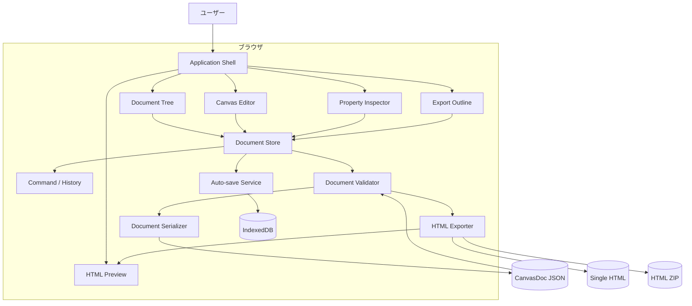
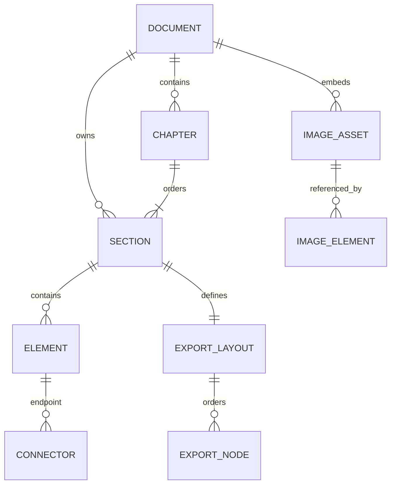
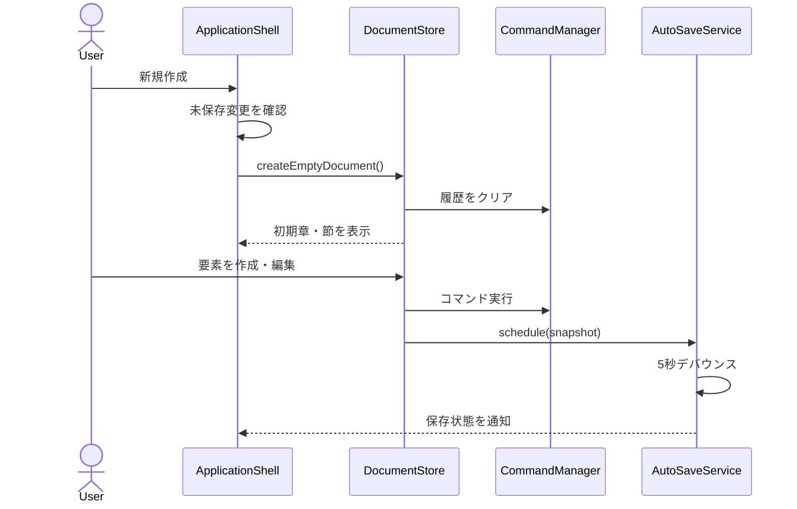
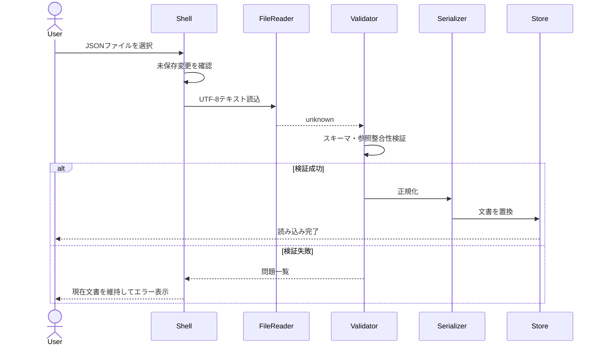
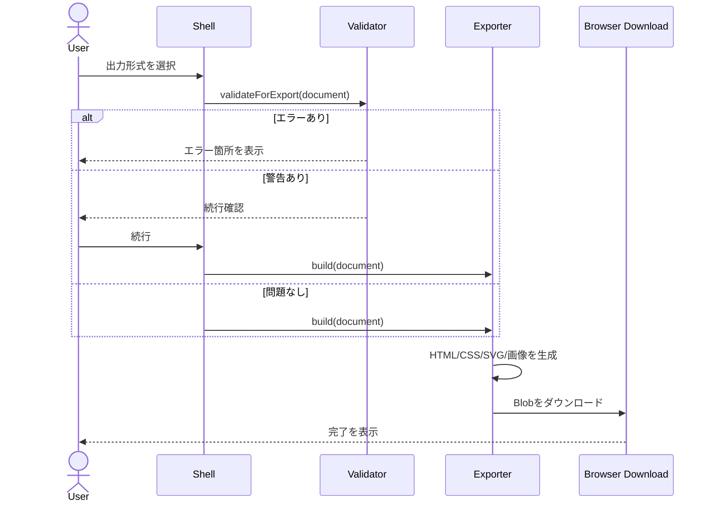

# 機能設計書 (Functional Design Document)

## 1. 文書情報

| 項目 | 内容 |
|---|---|
| プロダクト | CanvasDoc（仮称） |
| 対象リリース | MVP |
| 入力文書 | `docs/product-requirements.md` |
| 対象要件 | FR-01〜FR-09（P0） |
| 実行形態 | サーバーを使用しないブラウザアプリ |

## 2. システム構成



### 2.1 レイヤー構成

| レイヤー | 責務 |
|---|---|
| UI | 入力受付、選択状態の表示、キャンバス描画、ダイアログ、通知 |
| Application | ユースケース実行、コマンド管理、Undo/Redo、自動保存制御 |
| Domain | 文書モデル、制約、読み順、整列、SVG変換、出力モデル生成 |
| Infrastructure | JSON入出力、IndexedDB、ファイルダウンロード、ZIP生成、サニタイズ |

UIからブラウザAPIや永続化ライブラリを直接呼び出さない。Application層のユースケースを経由し、Domain層はReactおよびブラウザAPIに依存しない。

## 3. 技術スタック

| 分類 | 技術 | 選定理由 |
|---|---|---|
| 言語 | TypeScript | 文書要素の判別共用体と入出力スキーマを静的に検証できる |
| UI | React | 複数ペインと選択状態をコンポーネントとして分割しやすい |
| ビルド | Vite | クライアント専用アプリを高速に開発・配布できる |
| 状態管理 | Zustand + Immer | 文書状態とUI状態を分離し、イミュータブル更新を簡潔に記述できる |
| キャンバス | Konva / react-konva | パン、ズーム、選択、変形、図形、コネクタをCanvas 2Dで扱える |
| リッチテキスト | Tiptap | 許可する編集機能を拡張単位で制限できる |
| 入力検証 | Zod | TypeScript型と対応したJSON実行時検証を定義できる |
| HTMLサニタイズ | DOMPurify | リッチテキストとリンクの危険なHTMLを許可リストで除去できる |
| ブラウザ永続化 | IndexedDB（idb） | 50MB規模の画像を含む自動保存を非同期で扱える |
| ZIP生成 | JSZip | ブラウザ内でHTML、CSS、assetsをZIP化できる |
| ID生成 | Web Crypto `randomUUID()` | 外部サービスなしで安定した一意IDを生成できる |
| テスト | Vitest + Testing Library + Playwright | Domain単体、UI統合、ブラウザE2Eを分担できる |

サーバー、データベース、外部CDN、外部フォントはMVPでは使用しない。

## 4. データモデル

### 4.1 共通型

```typescript
type UUID = string;
type ISODateTime = string;
type SectionId = UUID;
type ElementId = UUID;
type AssetId = UUID;

interface Point {
  x: number;
  y: number;
}

interface Size {
  width: number;
  height: number;
}

interface Rect extends Point, Size {}

interface BorderStyle {
  color: string;       // #RRGGBB または #RRGGBBAA
  width: number;       // 0〜20
  style: "solid" | "dashed" | "dotted";
  radius: number;      // 0〜100
}

interface ElementStyle {
  color: string;
  backgroundColor: string;
  opacity: number;     // 0〜1
  fontFamily: "sans-serif" | "serif" | "monospace";
  fontSize: number;    // 8〜96 px
  textAlign: "left" | "center" | "right";
  border: BorderStyle;
}
```

色は保存時に正規化した16進形式を使用する。座標とサイズは有限数のみ許可し、`width`と`height`は1以上、通常要素の絶対値は1,000,000以下とする。

### 4.2 文書ルート

```typescript
interface CanvasDocumentFile {
  schemaVersion: 1;
  appVersion: string;
  document: CanvasDocument;
}

interface CanvasDocument {
  id: UUID;
  title: string;                 // 1〜200文字
  language: string;              // MVP既定値 "ja"
  createdAt: ISODateTime;
  updatedAt: ISODateTime;
  chapters: Chapter[];
  sections: Record<SectionId, Section>;
  assets: Record<AssetId, ImageAsset>;
  theme: DocumentTheme;
}

interface Chapter {
  id: UUID;
  title: string;                 // 1〜200文字
  sectionIds: SectionId[];
}

interface Section {
  id: SectionId;
  title: string;                 // 1〜200文字
  elements: Record<ElementId, DocumentElement>;
  zOrder: ElementId[];           // キャンバス描画順、後方ほど前面
  exportLayout: ExportLayout;
  viewport: CanvasViewport;
}

interface CanvasViewport {
  x: number;
  y: number;
  zoom: number;                  // 0.1〜4
}
```

### 4.3 文書要素

```typescript
type DocumentElement =
  | HeadingElement
  | RichTextElement
  | ImageElement
  | TableElement
  | ShapeElement
  | ConnectorElement
  | LinkElement;

interface ElementBase {
  id: ElementId;
  sectionId: SectionId;
  type: DocumentElement["type"];
  frame: Rect;
  rotation: number;              // -180〜180度
  locked: boolean;
  hidden: boolean;               // 編集画面のみ。HTML出力設定とは独立
  style: ElementStyle;
  createdAt: ISODateTime;
  updatedAt: ISODateTime;
}

interface HeadingElement extends ElementBase {
  type: "heading";
  level: 2 | 3 | 4 | 5 | 6;     // h1は文書タイトル専用
  text: string;                  // 1〜500文字
}

interface RichTextElement extends ElementBase {
  type: "richText";
  content: RichTextDocument;     // 許可済みTiptap JSON
}

interface ImageElement extends ElementBase {
  type: "image";
  assetId: AssetId;
  alt: string;                   // 0〜500文字。空の場合は出力時警告
  caption: string;               // 0〜1,000文字
  objectFit: "contain" | "cover";
}

interface TableElement extends ElementBase {
  type: "table";
  rows: TableRow[];              // 1〜200行
  headerRow: boolean;
  columnWidths: number[];        // 相対比。列数と一致
}

interface TableRow {
  id: UUID;
  cells: TableCell[];
}

interface TableCell {
  id: UUID;
  content: RichTextDocument;
}

interface ShapeElement extends ElementBase {
  type: "shape";
  shape: "rectangle" | "roundedRectangle" | "ellipse" | "diamond";
  text: string;                  // 0〜1,000文字
}

interface ConnectorElement extends ElementBase {
  type: "connector";
  from: ConnectorEndpoint;
  to: ConnectorEndpoint;
  routing: "straight" | "orthogonal";
  markerStart: "none" | "arrow";
  markerEnd: "none" | "arrow";
}

interface ConnectorEndpoint {
  elementId: ElementId;
  anchor: "top" | "right" | "bottom" | "left" | "center";
}

interface LinkElement extends ElementBase {
  type: "link";
  label: string;                 // 1〜500文字
  url: string;                   // http, https, mailtoのみ
  openInNewTab: boolean;
}
```

`RichTextDocument`はTiptapのJSON形式のうち、paragraph、text、bold、italic、bulletList、orderedList、listItem、link、hardBreakのみを許可する。読み込み時とHTML生成時の両方で同じ許可リストを検証する。

### 4.4 画像アセット

```typescript
interface ImageAsset {
  id: AssetId;
  fileName: string;
  mimeType: "image/png" | "image/jpeg" | "image/webp" | "image/gif";
  byteLength: number;
  dataUrl: string;
  width: number;
  height: number;
  checksum: string;              // SHA-256 hex
}
```

1画像の上限は20MB、文書全体の推奨上限は50MBとする。50MB超過時は警告するが、ブラウザが処理可能な限り編集を禁止しない。同じSHA-256とMIMEタイプの画像は同一アセットを再利用する。

### 4.5 HTML出力レイアウト

```typescript
interface ExportLayout {
  nodes: ExportNode[];
}

type ExportNode = ExportElementNode | ExportGroupNode;

interface ExportElementNode {
  kind: "element";
  id: UUID;
  elementId: ElementId;
  included: boolean;
}

interface ExportGroupNode {
  kind: "group";
  id: UUID;
  mode: "sideBySide" | "columns";
  children: ExportElementNode[];
  columnCount: 2 | 3 | 4;
  gap: number;                   // 0〜64px
}
```

一つの要素を同じ節の`ExportLayout`へ複数回登録してはならない。新規要素は末尾に`included: true`で自動登録する。要素削除時は対応ノードも同一コマンド内で削除する。

### 4.6 テーマ

```typescript
interface DocumentTheme {
  fontFamily: "sans-serif" | "serif";
  textColor: string;
  backgroundColor: string;
  accentColor: string;
  contentMaxWidth: number;       // MVP固定既定値 960px
}
```

MVPではテーマ編集UIを提供せず、既定値を保存する。P1のテーマ機能追加時に同じモデルを使用する。

### 4.7 関係図



### 4.8 整合性制約

- すべてのIDは文書内で一意とする。
- `Chapter.sectionIds`に現れる節IDは一度だけで、`sections`に存在しなければならない。
- 各要素の`sectionId`は格納先の節IDと一致し、`zOrder`に一度だけ存在しなければならない。
- コネクタの両端は同じ節に存在するコネクタ以外の要素を参照する。
- 画像要素の`assetId`は存在する画像アセットを参照する。
- 出力ノードは同じ節に存在する要素のみを参照する。
- 参照されない画像アセットは保存時に除去する。

## 5. アプリケーション状態

永続化対象の`DocumentState`と一時的な`UIState`を分離する。

```typescript
interface EditorState {
  document: CanvasDocument;
  ui: UIState;
  persistence: PersistenceState;
}

interface UIState {
  activeSectionId: SectionId | null;
  selectedElementIds: ElementId[];
  activeTool:
    | "select"
    | "pan"
    | "heading"
    | "richText"
    | "image"
    | "table"
    | "shape"
    | "connector"
    | "link";
  rightPanel: "properties" | "exportOutline" | "preview";
  dialog: DialogState | null;
}

interface PersistenceState {
  dirty: boolean;
  lastExplicitSaveAt: ISODateTime | null;
  lastAutoSaveAt: ISODateTime | null;
  autoSaveStatus: "idle" | "saving" | "saved" | "failed";
}
```

選択状態、開いているダイアログ、Undo/Redo履歴はJSONファイルへ保存しない。節ごとのビューポートだけは文書モデルへ保存する。

## 6. コンポーネント設計

### 6.1 ApplicationShell

**責務**:

- 3ペインレイアウトと上部ツールバーの構成
- グローバルショートカットと未保存離脱警告
- ダイアログ、トースト、エラーバウンダリーの配置

```typescript
interface ApplicationShellController {
  createNewDocument(): Promise<void>;
  requestOpenDocument(file: File): Promise<void>;
  saveDocument(): Promise<void>;
  exportDocument(mode: "singleHtml" | "zip"): Promise<void>;
}
```

### 6.2 DocumentTree

**責務**:

- 章・節の表示、選択、追加、名称変更、並べ替え
- 配下データを伴う削除の確認

```typescript
interface DocumentTreeActions {
  addChapter(title: string): void;
  addSection(chapterId: UUID, title: string): void;
  renameNode(id: UUID, title: string): void;
  moveChapter(chapterId: UUID, targetIndex: number): void;
  moveSection(sectionId: SectionId, targetChapterId: UUID, targetIndex: number): void;
  deleteNode(id: UUID): void;
}
```

### 6.3 CanvasEditor

**責務**:

- Konva Stageのパン、ズーム、選択矩形、要素描画
- Transformerによる移動、リサイズ、回転
- 要素ツールによる新規作成とコネクタ接続
- 画面座標とワールド座標の相互変換

```typescript
interface CanvasEditorActions {
  setViewport(sectionId: SectionId, viewport: CanvasViewport): void;
  createElement(input: CreateElementInput): ElementId;
  updateElementFrame(elementIds: ElementId[], frames: Rect[]): void;
  alignElements(elementIds: ElementId[], mode: AlignmentMode): void;
  duplicateElements(elementIds: ElementId[]): ElementId[];
  deleteElements(elementIds: ElementId[]): void;
}
```

ドラッグ中はローカル表示値を更新し、ポインターを離した時点で一つの履歴コマンドとしてStoreへ確定する。ズームはポインター位置を中心とし、`newZoom = clamp(oldZoom × factor, 0.1, 4)`で計算する。

### 6.4 RichTextEditor

**責務**:

- Tiptap編集面の表示
- 許可ノード・マークだけを使用した編集
- 編集開始・確定・キャンセルの制御

キャンバス要素をダブルクリックまたはEnterで編集モードにする。編集中のショートカットはリッチテキスト編集を優先し、確定時に一つの履歴コマンドを生成する。

### 6.5 PropertyInspector

**責務**:

- 単一選択時の型固有プロパティ表示
- 複数選択時の共通プロパティ表示
- 数値、色、URLなどの入力検証

連続入力は300msでまとめ、同じフィールドに対する連続変更を一つのUndo単位にする。無効値はStoreへ反映せず、入力欄に理由を表示する。

### 6.6 ExportOutline

**責務**:

- HTML出力順、含有状態、グループの表示
- 全幅要素と横並び・段組グループの作成
- キーボードおよびドラッグによる並べ替え

```typescript
interface ExportOutlineActions {
  setIncluded(elementId: ElementId, included: boolean): void;
  moveNode(nodeId: UUID, targetIndex: number): void;
  createGroup(
    mode: "sideBySide" | "columns",
    elementIds: ElementId[]
  ): UUID;
  ungroup(groupId: UUID): void;
  updateGroup(groupId: UUID, patch: Partial<ExportGroupNode>): void;
}
```

### 6.7 CommandManager

**責務**:

- 文書を変更する操作の実行
- 最大100件のUndo/Redo
- 複数モデルを変更する操作の原子性確保

```typescript
interface EditorCommand {
  id: UUID;
  label: string;
  execute(document: CanvasDocument): CanvasDocument;
  undo(document: CanvasDocument): CanvasDocument;
  mergeKey?: string;
}

interface CommandManager {
  execute(command: EditorCommand): void;
  undo(): void;
  redo(): void;
  canUndo(): boolean;
  canRedo(): boolean;
  clear(): void;
}
```

ファイル読み込みと新規作成では履歴をクリアする。自動保存とエクスポートは文書を変更しないため履歴へ追加しない。

### 6.8 DocumentValidator

**責務**:

- JSON構造のZod検証
- 参照整合性と制約の検証
- エクスポート前警告・エラーの生成

```typescript
interface ValidationIssue {
  severity: "error" | "warning";
  code: string;
  message: string;
  sectionId?: SectionId;
  elementId?: ElementId;
  path?: string;
}

interface DocumentValidator {
  validateForLoad(input: unknown): ValidationResult<CanvasDocumentFile>;
  validateForSave(document: CanvasDocument): ValidationResult<CanvasDocument>;
  validateForExport(document: CanvasDocument): ValidationIssue[];
}
```

エラーは処理を中断する。警告は一覧表示し、ユーザーが確認した場合のみエクスポートを続行できる。

### 6.9 DocumentSerializer

**責務**:

- 参照されない画像の除去
- 日時、色、数値の正規化
- 安定したキー順でのUTF-8 JSON生成
- 将来のスキーマ移行

```typescript
interface DocumentSerializer {
  serialize(document: CanvasDocument): Promise<Blob>;
  deserialize(input: string): Promise<CanvasDocument>;
}

interface Migration {
  fromVersion: number;
  toVersion: number;
  migrate(input: unknown): unknown;
}
```

MVPが読み込めるのは`schemaVersion: 1`のみとする。未知の上位バージョンは拒否する。下位バージョン対応が必要になった時点で連続したMigrationを追加する。

### 6.10 AutoSaveService

**責務**:

- 文書変更の監視と5秒以内のデバウンス保存
- IndexedDBへのスナップショット保存
- 起動時の復元候補取得と破棄

```typescript
interface AutoSaveRecord {
  key: "current-document";
  schemaVersion: 1;
  documentId: UUID;
  savedAt: ISODateTime;
  data: CanvasDocumentFile;
}

interface AutoSaveService {
  schedule(document: CanvasDocumentFile): void;
  flush(): Promise<void>;
  loadRecovery(): Promise<AutoSaveRecord | null>;
  discardRecovery(): Promise<void>;
}
```

保存は最新スナップショット一件をトランザクションで置換する。タブ終了時の非同期保存は保証せず、変更後5秒以内の通常保存と`visibilitychange`時の`flush()`で損失範囲を抑える。

### 6.11 HtmlExporter

**責務**:

- 文書モデルから出力専用モデルへの変換
- 意味的HTML、CSS、SVG、画像アセットの生成
- 単一HTML BlobとZIP Blobの生成

```typescript
interface ExportOptions {
  mode: "singleHtml" | "zip";
  generatedAt: ISODateTime;
}

interface ExportBundle {
  html: string;
  css: string;
  assets: ExportAsset[];
}

interface HtmlExporter {
  build(document: CanvasDocument): ExportBundle;
  toSingleHtml(bundle: ExportBundle): Blob;
  toZip(bundle: ExportBundle): Promise<Blob>;
}
```

単一HTMLとZIPは必ず同一の`ExportBundle`から生成し、DOM構造とCSS規則の差異を防ぐ。

## 7. 主要ユースケース

### 7.1 新規文書の作成と編集



空文書は「無題の文書」、章「第1章」、節「セクション1」を一つずつ持つ。

### 7.2 JSONファイルの読み込み



読み込みは検証と正規化が完了するまでStoreを変更しない。

### 7.3 HTMLエクスポート



### 7.4 自動保存からの復元

起動時にIndexedDBの`current-document`を確認する。復元候補がある場合は文書タイトルと保存日時を表示し、「復元」「破棄」の選択が終わるまで空文書を編集可能にしない。復元後は`dirty: true`とし、明示的なJSON保存を促す。

## 8. UI設計

### 8.1 画面レイアウト

```text
┌──────────────────────────────────────────────────────────────────────┐
│ ファイル  元に戻す/やり直す  要素ツール群       保存状態  出力      │
├──────────────┬──────────────────────────────────┬───────────────────┤
│ 文書ツリー   │                                  │ プロパティ        │
│              │          無限キャンバス           │ ────────────────  │
│ 第1章        │                                  │ 出力アウトライン  │
│  ├ 節1       │                                  │ ────────────────  │
│  └ 節2       │                                  │ プレビュー        │
│              │                                  │                   │
├──────────────┴──────────────────────────────────┴───────────────────┤
│ ズーム率 / 座標 / 選択数 / 警告 / 最終保存日時                      │
└──────────────────────────────────────────────────────────────────────┘
```

| 領域 | 幅・動作 | 主な内容 |
|---|---|---|
| 上部ツールバー | 高さ48px、固定 | ファイル操作、Undo/Redo、要素追加、出力 |
| 左ペイン | 240px、160〜480pxでリサイズ | 文書タイトル、章・節ツリー |
| 中央キャンバス | 残余幅、最小480px | グリッド、要素、選択矩形、ズーム |
| 右ペイン | 320px、280〜520pxでリサイズ | プロパティ、出力アウトライン、プレビュー |
| ステータスバー | 高さ28px、固定 | 保存状態、ズーム、選択数、警告 |

画面幅が1024px未満の場合は編集非対応の案内を表示する。右ペインは折り畳み可能とする。

### 8.2 操作モード

| モード | 開始 | 完了 | Esc |
|---|---|---|---|
| 選択 | 選択ツール、V | クリックまたはドラッグ選択 | 選択解除 |
| パン | パンツール、Space押下中 | ドラッグ終了 | 選択ツールへ戻る |
| 要素作成 | ツール選択 | キャンバスのクリックまたはドラッグ | 作成を中止 |
| テキスト編集 | ダブルクリック、Enter | 要素外クリック、Ctrl+Enter | 変更を破棄 |
| コネクタ | 始点アンカー選択 | 終点アンカー選択 | 接続を中止 |

### 8.3 選択と重なり

- クリックは最前面の未ロック要素を選択する。
- Shift+クリックで選択を追加・解除する。
- ドラッグ選択は矩形と交差する未ロック要素を対象にする。
- ロック要素は選択できるが移動・リサイズできず、Inspectorから解除できる。
- 非表示要素はキャンバスに描画せず、出力対象のままなら出力アウトラインに警告アイコンを表示する。

### 8.4 ダイアログ

| ダイアログ | 起動条件 | 操作 |
|---|---|---|
| 未保存確認 | 新規、読み込み、ブラウザ離脱 | 保存して続行、破棄、キャンセル |
| 削除確認 | 章・節の削除 | 削除、キャンセル |
| 復元確認 | 起動時に自動保存あり | 復元、破棄 |
| 出力検証 | エクスポート警告あり | 問題箇所へ移動、続行、キャンセル |
| ファイルエラー | 読み込み・保存・出力失敗 | 詳細表示、閉じる、再試行可能時は再試行 |

### 8.5 出力プレビュー

右ペインのプレビューは、HtmlExporterが生成したHTML本文をサンドボックス付き`iframe`へ`srcdoc`で表示する。`sandbox`に`allow-scripts`を付与せず、外部ナビゲーションを許可しない。文書変更後500msで再生成し、生成中は直前のプレビューを維持する。

## 9. アルゴリズム設計

### 9.1 座標変換

```typescript
function screenToWorld(
  screen: Point,
  stageOrigin: Point,
  viewport: CanvasViewport
): Point {
  return {
    x: (screen.x - stageOrigin.x - viewport.x) / viewport.zoom,
    y: (screen.y - stageOrigin.y - viewport.y) / viewport.zoom,
  };
}
```

ズーム時はポインター配下のワールド座標が変化しないよう、新しい`x`、`y`を逆算する。

### 9.2 整列

- 左・右・上・下揃えは選択集合の外接矩形を基準にする。
- 水平中央・垂直中央揃えは外接矩形の中心を基準にする。
- 2要素未満では実行不可とする。
- ロック要素を含む場合は実行せず、ロック解除を案内する。
- 全要素の変更を一つのCommandとして確定する。

### 9.3 コネクタ追従

アンカー座標は接続先要素の回転前の矩形辺中央を求め、要素中心を基準に回転変換する。直線は2アンカーを結ぶ。直交線は始点・終点の向きに応じて中間点を2点以下生成し、自己交差する候補を避ける。要素移動中は描画時に再計算し、コネクタ自身の`frame`は保存前に全点の外接矩形へ更新する。

### 9.4 HTML出力変換

1. 章配列と各章の`sectionIds`を順に処理する。
2. 文書タイトルを`h1`、章を`section > h2`、節を`section > h3`として生成する。
3. 節の`ExportLayout.nodes`を先頭から処理する。
4. `included: false`のノードを除外する。
5. 単独要素は型別レンダラーへ渡す。
6. グループはCSS Gridコンテナを生成し、子要素を指定順にレンダリングする。
7. 768px以下では全グループを1列にする。
8. 図形とコネクタが連続または同一グループ内に存在する場合、関連要素の外接矩形からSVG `viewBox`を生成する。
9. HTML、属性値、URL、リッチテキストをサニタイズする。
10. DOMツリー、CSS、画像の整合性を検証して`ExportBundle`を返す。

要素型とHTMLの対応は次のとおり。

| 要素 | HTML |
|---|---|
| 見出し | 設定レベルの`h2`〜`h6`。章・節見出しと衝突する場合は階層を補正 |
| リッチテキスト | `p`、`strong`、`em`、`ul`、`ol`、`li`、`a` |
| 画像 | `figure > img + figcaption` |
| 表 | `table > thead/tbody > tr > th/td` |
| 図形 | インライン`svg` |
| コネクタ | 関連図形と同じインライン`svg` |
| リンク | `a` |

見出しレベル補正時はエクスポート検証で警告し、DOM上で1段ずつ増加する階層に正規化する。

### 9.5 SVG変換

- 対象図形群の外接矩形へ上下左右16pxの余白を加え、`viewBox`とする。
- `width: 100%`、`height: auto`、`preserveAspectRatio="xMidYMid meet"`を設定する。
- 図形は`rect`、`ellipse`、`polygon`、テキストは`text`と`tspan`へ変換する。
- コネクタは`line`または`polyline`、矢印は文書内で一意な`marker`を使用する。
- キャンバス外の座標は`viewBox`基準へ平行移動する。
- SVG内の文字列もHTMLと同じエスケープ処理を行う。

### 9.6 ファイル名生成

文書タイトルをUnicode正規化し、制御文字とWindows禁止文字`<>:"/\|?*`を`-`へ置換する。前後の空白とピリオドを除去し、空の場合は`canvasdoc`を使用する。最大80文字へ切り詰め、拡張子として`.canvasdoc.json`、`.html`、`.zip`を付与する。

ZIPの画像名は`assets/{assetId}.{extension}`で生成し、元ファイル名をパスへ使用しない。

## 10. ファイル入出力

### 10.1 編集ファイル例

```json
{
  "schemaVersion": 1,
  "appVersion": "0.1.0",
  "document": {
    "id": "080fcb21-1d8d-4b8a-8bb6-b077bd885c07",
    "title": "運用手順書",
    "language": "ja",
    "createdAt": "2026-07-30T01:00:00.000Z",
    "updatedAt": "2026-07-30T02:00:00.000Z",
    "chapters": [
      {
        "id": "a1b2c3d4-0000-4000-8000-000000000001",
        "title": "準備",
        "sectionIds": ["a1b2c3d4-0000-4000-8000-000000000002"]
      }
    ],
    "sections": {},
    "assets": {},
    "theme": {
      "fontFamily": "sans-serif",
      "textColor": "#1F2937",
      "backgroundColor": "#FFFFFF",
      "accentColor": "#2563EB",
      "contentMaxWidth": 960
    }
  }
}
```

実ファイルでは`sections`に完全な節データを含める。JSONは2スペースインデント、末尾改行付きで出力する。

### 10.2 ZIP構造

```text
canvasdoc-export.zip
├── index.html
├── styles.css
└── assets/
    ├── {asset-id}.png
    └── {asset-id}.webp
```

単一HTMLではCSSを`style`要素へ、画像をData URLとして埋め込む。ZIPではCSSを外部ファイル、画像をバイナリへ変換する。どちらも外部ネットワークへ依存しない。

## 11. エラーハンドリング

### 11.1 エラー分類

| コード | 種別 | 処理 | ユーザー表示 |
|---|---|---|---|
| `DOC_INVALID_JSON` | 読み込み | 現在文書を維持して中断 | 「JSONファイルを読み取れません」 |
| `DOC_UNSUPPORTED_VERSION` | 読み込み | 現在文書を維持して中断 | 「このファイルのバージョンには対応していません」 |
| `DOC_REFERENCE_BROKEN` | 読み込み | 問題パスを記録して中断 | 「文書内の参照関係が壊れています」 |
| `ASSET_UNSUPPORTED_TYPE` | 画像追加 | 追加せず中断 | 「PNG、JPEG、WebP、GIFを選択してください」 |
| `ASSET_TOO_LARGE` | 画像追加 | 追加せず中断 | 「画像は1ファイル20MB以下にしてください」 |
| `AUTOSAVE_QUOTA` | 自動保存 | 編集継続、状態をfailedにする | 「自動保存の容量が不足しています。JSONで保存してください」 |
| `AUTOSAVE_FAILED` | 自動保存 | 編集継続、再変更時に再試行 | 「自動保存に失敗しました」 |
| `EXPORT_VALIDATION` | 出力 | エラー時中断、警告時確認 | 問題一覧と該当要素への移動操作 |
| `EXPORT_GENERATION` | 出力 | 文書を変更せず中断 | 「HTMLの生成に失敗しました」 |
| `DOWNLOAD_FAILED` | 保存・出力 | Blobを破棄し再試行可能にする | 「ファイルを保存できませんでした」 |
| `UNEXPECTED` | 全体 | エラーバウンダリーで隔離 | 「予期しないエラーが発生しました。JSON保存を試してください」 |

### 11.2 エラー表示規則

- トーストは成功通知と、操作を妨げない警告に使用する。
- 入力検証は該当フィールド直下に表示する。
- データ損失または処理中断につながるエラーはモーダルで表示する。
- 開発用のスタックトレースを本番UIへ表示しない。
- エラーには一意なコードを表示し、原因、影響、次の操作を日本語で示す。

## 12. セキュリティ設計

- リッチテキストJSONは許可ノードと許可属性だけを受理し、HTML文字列を文書モデルへ保存しない。
- HTML生成時はDOM APIまたは安全なテンプレート関数を使用し、文字列連結へ未処理のユーザー入力を渡さない。
- URLは`URL` APIで解析し、`http:`、`https:`、`mailto:`だけを許可する。
- プレビューiframeはスクリプト、フォーム、トップナビゲーション、同一オリジン権限を与えない。
- SVGの`foreignObject`、スクリプト、外部参照、イベント属性を生成しない。
- JSON読み込み時はプロトタイプ汚染につながるキーをモデルへコピーせず、Zodの定義済みフィールドのみを採用する。
- ZIPのパスはアプリ側の固定値とアセットIDからのみ生成する。
- ファイル内容、タイトル、利用履歴をネットワークへ送信しない。

## 13. パフォーマンス設計

- Zustandのセレクターで節・要素単位に購読し、文書全体の変更による全要素再描画を避ける。
- 非表示節のKonva Stageをアンマウントし、アクティブ節のみ描画する。
- ドラッグ中はStore更新を毎フレーム行わず、描画オブジェクトを直接更新して終了時に確定する。
- 画像は読み込み時にデコード結果をキャッシュし、Data URLの再デコードを避ける。
- 画像、JSON、ZIP生成は非同期処理とし、進捗表示とキャンセルを提供する。計測で50ms超のメインスレッド停止が確認された処理はWeb Workerへ移す。
- 出力プレビューは500msデバウンスし、文書変更ごとの即時フル生成を避ける。
- Undo/Redo履歴は差分コマンドで保持し、画像バイナリを履歴ごとに複製しない。

## 14. テスト戦略

### 14.1 ユニットテスト

- 全データ型のZod検証境界値
- 章・節・要素の追加、移動、削除と参照整合性
- 整列、座標変換、ズーム中心計算
- CommandManagerの実行、Undo、Redo、履歴上限、連続変更のマージ
- コネクタのアンカー座標と直交経路
- ファイル名正規化とアセット名生成
- HTML要素型別レンダラーとエスケープ
- SVGのviewBox、図形、矢印生成
- JSON正規化、未参照アセット除去、上位バージョン拒否
- URL許可リスト、リッチテキスト許可リスト

### 14.2 コンポーネント統合テスト

- 文書ツリー操作がStoreとキャンバス表示へ反映される。
- 要素選択に応じてPropertyInspectorが切り替わる。
- 要素作成・削除がExportOutlineへ同期される。
- 複数要素の移動と整列が一回のUndoで戻る。
- 不正なプロパティ値がStoreへ反映されない。
- 自動保存のデバウンス、成功、容量不足、復元が正しく処理される。
- 出力警告から該当節・要素へ移動できる。

### 14.3 E2Eテスト

- 新規文書で2節、本文、画像、表、図形、コネクタを作成する。
- 文書をJSON保存し、ページ再読込後に読み込んで同一状態を確認する。
- 未保存状態で新規作成・読み込みを行い、確認ダイアログの各分岐を確認する。
- ブラウザを再起動し、自動保存から復元・破棄する。
- 単一HTMLを出力し、オフラインで本文、画像、表、SVG、リンクを確認する。
- ZIPを出力・展開し、相対アセット参照とオフライン表示を確認する。
- 360px、768px、1440pxで読み順、段組解除、横スクロール有無を確認する。
- Chrome、Edge、Firefoxで標準文書を読み込み・編集・出力する。

### 14.4 セキュリティテスト

- リッチテキスト、見出し、図形テキスト、キャプションへHTMLとスクリプトを入力する。
- `javascript:`、`data:text/html`、不正URLをリンクへ設定する。
- `__proto__`、巨大数値、重複ID、循環参照相当の不正JSONを読み込む。
- SVG属性と画像ファイル名を用いたインジェクションを試行する。
- ZIP内のパストラバーサルが生成されないことを確認する。

### 14.5 パフォーマンステスト

- 50節、500要素、画像合計50MBの固定データセットを使用する。
- 読み込み5秒以内、HTML/ZIP生成10秒以内を計測する。
- パン、ズーム、単一要素移動のフレームレートを計測し、95%以上が30fps以上であることを確認する。
- 100件のUndo/Redoでメモリ使用量が継続的に増加しないことを確認する。

## 15. 要件トレーサビリティ

| PRD要件 | 設計箇所 | 主なテスト |
|---|---|---|
| FR-01 文書と章・節 | 4.2、6.2、7.1、8 | ツリー統合、作成E2E |
| FR-02 無限キャンバス | 4.3、6.3、8.2、9.1〜9.3 | 座標単体、キャンバスE2E |
| FR-03 文書要素 | 4.3〜4.4、6.4 | 型別レンダラー、要素作成E2E |
| FR-04 プロパティ | 4.1、6.5、8.3 | Inspector統合 |
| FR-05 読み順・レイアウト | 4.5、6.6、9.4 | Outline統合、レスポンシブE2E |
| FR-06 保存・読み込み | 4.2〜4.8、6.8〜6.9、10.1 | シリアライズ単体、復元E2E |
| FR-07 自動保存 | 5、6.10、7.4 | IndexedDB統合、復元E2E |
| FR-08 単一HTML | 6.11、7.3、9.4〜9.6 | HTML生成単体、オフラインE2E |
| FR-09 ZIP | 6.11、9.6、10.2 | ZIP統合、オフラインE2E |

## 16. 設計上の決定事項

- 自動保存には`localStorage`ではなくIndexedDBを使用する。
- キャンバス描画はDOM絶対配置ではなくKonvaを使用する。
- 編集文書はHTMLではなく型付きJSONを正とする。
- リッチテキストはHTML文字列ではなく制限されたTiptap JSONで保存する。
- キャンバスの`zOrder`とHTMLの`ExportLayout`を独立させる。
- 単一HTMLとZIPは同じ中間表現`ExportBundle`から生成する。
- HTML出力はJavaScriptなしで閲覧可能にする。
- MVPの文書ファイルスキーマは`schemaVersion: 1`とし、上位バージョンを安全に拒否する。

